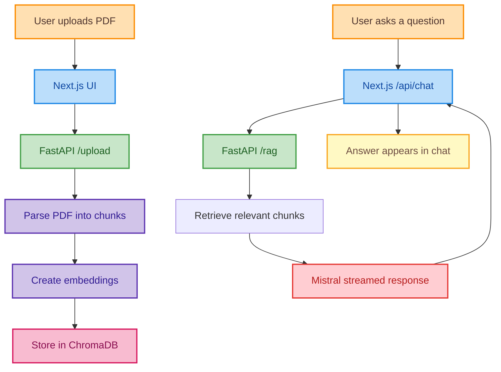

# EduMatrix AI

EduMatrix AI is a document-grounded chat experience that turns a PDF into an interactive study companion. A user uploads a document, asks a question in plain language, and gets a streamed answer built from the document’s retrieved context rather than from a generic model response.

   

## What it does

The product is designed around a simple user story:

1. Upload a PDF.
2. The backend extracts text, chunks it, and creates embeddings.
3. Ask a question about the document.
4. The app retrieves the most relevant chunks and sends them to Mistral.
5. The answer streams back into the chat UI.

That flow keeps the experience focused and easy to explain in an interview: a clean frontend, a lightweight retrieval layer, and a streaming LLM response on top.

## Why it stands out

- Document-aware answers instead of free-form chat.
- Streaming responses for a faster, more conversational feel.
- A split frontend/backend architecture that mirrors production AI applications.
- PDF-first UX with a minimal upload-and-ask workflow.
- Retry, stop, and copy controls that make the chat experience feel polished.

## Product Flow



## Architecture

### Frontend: `nextjs2`

The Next.js app provides the chat interface and the document upload experience. It handles the user interaction layer, streams responses from the API route, and keeps the interface responsive with loading, retry, stop, and copy actions.

Key pieces:

- `app/page.tsx` handles upload, chat state, streaming, and UI feedback.
- `app/api/chat/route.ts` retrieves context from the Python service and streams the final Mistral answer.
- `utils/retry.ts` adds a simple retry wrapper for transient request failures.

### Backend: `rag-service`

The Python service is the retrieval engine. It receives a PDF, extracts text, chunks it into manageable segments, builds embeddings, and stores them in ChromaDB. When the frontend asks a question, the service returns the most relevant document chunks as context.

Key pieces:

- `routers/upload.py` exposes `/upload` and `/rag`.
- `utils/pdf_parser.py` extracts text from PDFs with PyMuPDF.
- `utils/embedder.py` generates embeddings with SentenceTransformers.
- `utils/vector_store.py` stores and queries the active document index in ChromaDB.

## Tech Stack

- Next.js 15 + React 19 + TypeScript for the interface.
- FastAPI for the retrieval API.
- ChromaDB for vector storage.
- SentenceTransformers for embeddings.
- PyMuPDF for PDF extraction.
- Mistral for streamed answer generation.

## Local Setup

### Prerequisites

- Node.js 18+
- Python 3.8+
- npm and pip

### Frontend

```bash
cd nextjs2
npm install
```

Create `nextjs2/.env.local`:

```env
MISTRAL_API_KEY=your_mistral_api_key
```

### Backend

```bash
cd rag-service
python -m venv .venv
.venv\Scripts\activate
pip install fastapi uvicorn python-multipart chromadb pymupdf sentence-transformers
```

If your environment does not already include PyTorch, install the version recommended by SentenceTransformers for your platform.

### Run the app

Start the backend first, then the frontend:

```bash
cd rag-service
uvicorn main:app --host 0.0.0.0 --port 8000
```

```bash
cd nextjs2
npm run dev
```

Open `http://localhost:3000` in your browser.

## User Experience Notes

- Uploading a PDF loads it into the active document context.
- The input stays disabled until a PDF is selected.
- The response is streamed, so the answer appears progressively.
- A stop button lets the user cancel generation.
- The current vector store is reset on each new upload, so the app behaves like a focused single-document assistant.

## Project Scope

This repository is structured as a portfolio-ready AI product rather than a generic demo. It shows frontend composition, API orchestration, retrieval-augmented generation, and a clear document-to-answer user journey that is easy to discuss in interviews.

## License

MIT. See [LICENSE](LICENSE).